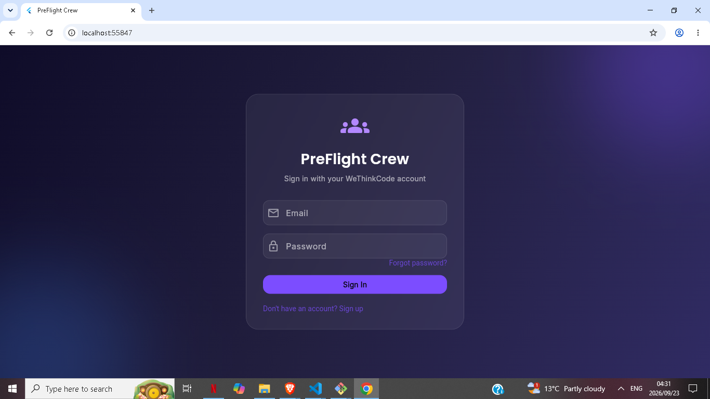
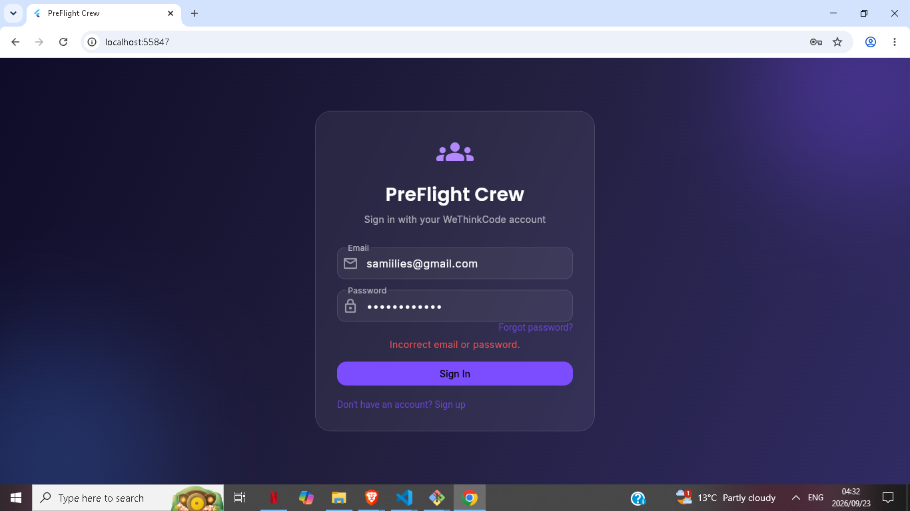
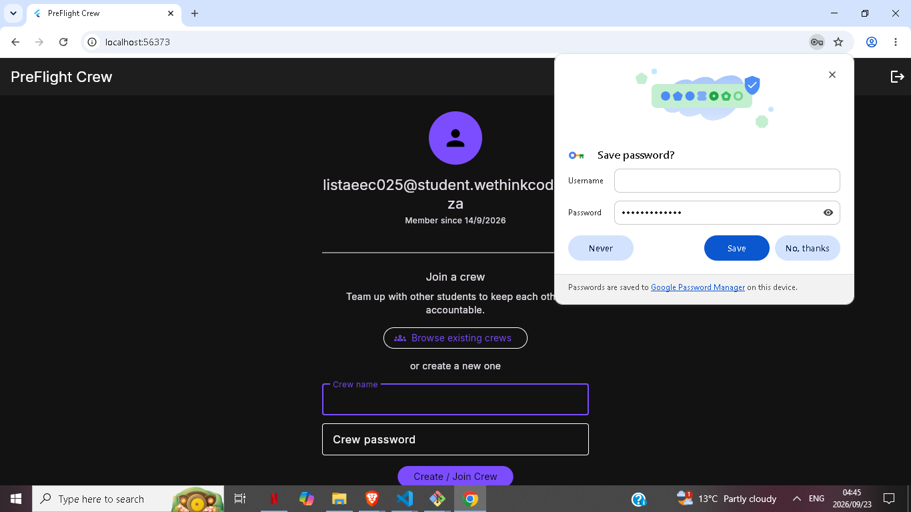
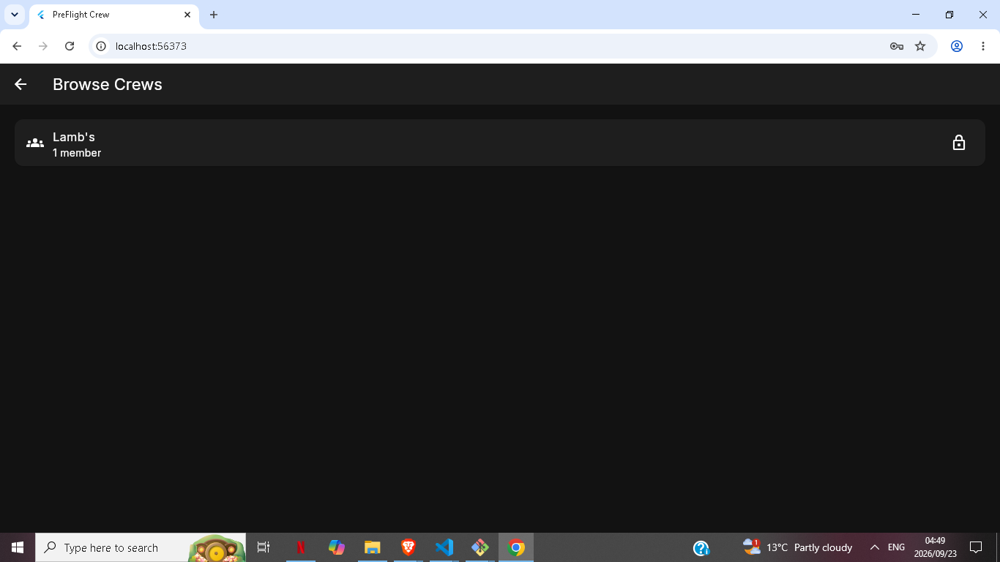
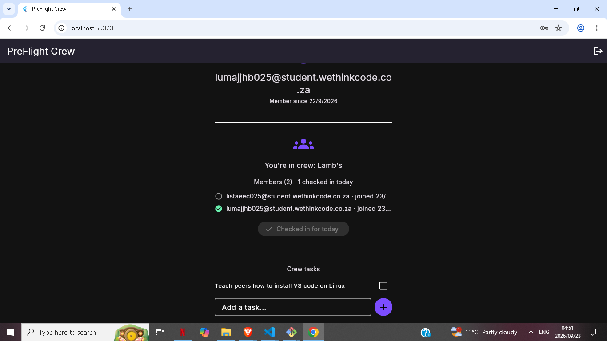

# PreFlight Crew

A secure, Firebase-backed accountability platform for WeThinkCode students, built for the Mobile Development elective (Track 2: Firebase Authentication).

## Problem

Peer accountability only works if you trust who you're working with. PreFlight Crew restricts access to verified @student.wethinkcode.co.za accounts, then lets small groups form password-protected "crews" to track daily check-ins and share a task list - real infrastructure for real accountability, not just a login screen.

## Features

### Authentication
- Email/password signup restricted to @student.wethinkcode.co.za addresses
- Mandatory email verification before accessing the app (enforced via userChanges() stream)
- Password reset flow with a real emailed reset link
- Auth-state-driven routing between login, verify-email, and home screens

### Crew System
- Create or join password-protected crews (password hashed with SHA-256, verified server-side via Firestore rules)
- Browse a live directory of existing crews with member counts
- Daily check-in tracking per crew member, visible to the whole crew in real time
- Shared task list per crew - add, complete, and see who completed what
- Firestore security rules enforce membership before any read/write, and restrict which fields each write can touch

## Tech Stack

- Flutter (web target, Chrome)
- Dart
- Firebase Authentication (firebase_auth)
- Cloud Firestore (cloud_firestore) - real-time crew data, check-ins, and tasks
- Firestore Security Rules - server-side enforcement of membership and field-level write permissions
- crypto package - SHA-256 password hashing for crew access
- google_fonts - Inter typeface for consistent, polished typography
- flutter_animate - entrance animations on key screens

## Run It

    flutter pub get
    flutter run -d chrome

## Screenshots

## Wiki

Full project documentation and a session-by-session development log are available on the [project wiki](https://github.com/standard-archive/preflight-crew-auth/wiki).
